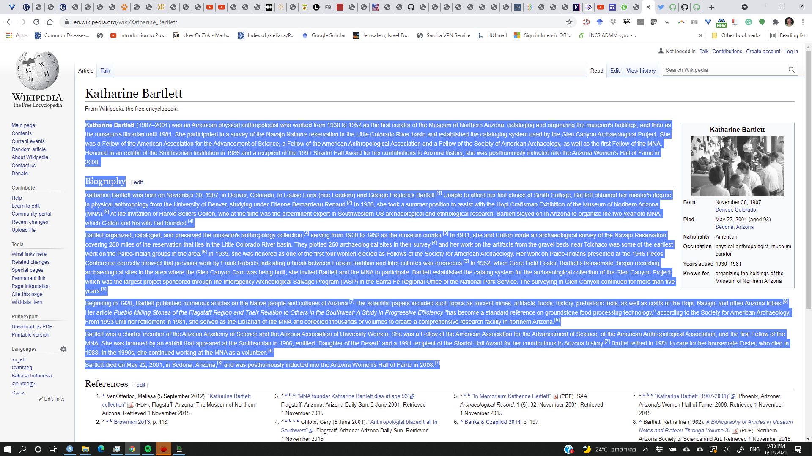

## Submission Instructions 

This lab will be submitted in pairs using GitHub (if you don't have a pair, 
please contact us).  
Please follow the steps in the  [GitHub-Classroom Lab 3](https://classroom.github.com/g/9t2M5lza) to create your group's Lab 3 repository.  
**Important: your team's name must be `FamilyName1_Name1_and_FamilyName2_Name2`**.  
You can collaborate with your partner using the git environment; You can either 
make commits straight to master, or create individual branches (recommended). 
However, once done, be sure to merge your branches to master - you will be 
graded using the most recent *master* version - your last push and merge 
before the deadline.   
**Please do not open/review other peoples' repositories - we will be notified by GitHub if you do.**

Your final push should include this Rmd file (with your answers) together with 
the html file that is outputted automatically by knitr when you knit the Rmd. 
Anything else will be disregarded. In addition, please adhere to the following 
file format:    
`Lab_3_FamilyName1_Name1_and_FamilyName2_Name2.Rmd/html`      


The lab consists of $15$ questions. Each question is worth $7$ points. Questions vary in difficulty and length. <br>
Some questions may require data wrangling and manipulation which you need to 
decide on.   
In some graphs you may need to change the graph limits. 
If you do so, please include the outlier points you have removed in a separate table.  

Show numbers in plots/tables using standard digits and not scientific display. 
That is: 90000000 and not 9e+06.  
Round numbers to at most 3 digits after the dot - that is, 9.456 and not 9.45581451044

The required libraries are listed in the Rmd file below the instructions. You are allowed 
to add additional libraries if you want. <br>
If you do so, *please explain what libraries you've added, and what is each new library used for*. 

##############################################################################


```{r, echo = FALSE, warning=FALSE, message=FALSE, results = 'hide'}
library(ggplot2)
library(tidyverse)
library(rvest)
library(stringr)
options(scipen=999)


setwd("C:\\Users\\Or Zuk\\GoogleDriveHuji\\HUJI\\Teaching\\R_52414\\2021\\Exercises\\labs\\lab_3")

```

<br>


**Background:** The lab will focus on text analysis, sampling and inference. We will extract text from wikipedia describing 
notable female scientists from the 20th century. 


1. Use the library `rvest` to scrape all the **names** of notable female scientists of the 20th century from 
[here](https://en.wikipedia.org/wiki/List_of_female_scientists_in_the_20th_century). For ease of exctraction, you can extract only scientists with known birth or death year. 
You should end up with a `names` vector of at least `488` elements, where each element is a name of a different female scientist. 

[YOUR SOLUTION HERE]


2. When you click on each scientist name, you are transferred into a different url containing text about this scientist. 
For example, clicking on the first name `Katharine Bartlet`, brings you [here](https://en.wikipedia.org/wiki/Katharine_Bartlett).
Parse the data and create a new vector variable `names_urls` containing the url for each scientist. 
You may need to modify the names to get the exact urls. 
You don't have to be perfect here, and it is enough to get the correct urls for at least $400$ out of the $488$ scientists.   

[YOUR SOLUTION HERE]


3. Next we would like to retrieve the actual texts about each scientist. 
Write a function called `wiki_text_parser` that given a specific scientist's unparsed html page text as input, 
outputs the parsed biographical text as a string. <br>
The text should start at the line below the line `From Wikipedia, the free encyclopedia` in the wikipedia page. <br>
The text should end right before the `References` of the wikipedia page. See for example the highlighted text below. <br>
Run the function on the first name `Katharine Bartlet` and verify that the biographical text is extracted correctly. <br>
**Hint:** You can look at occurances of the scientist name





[YOUR SOLUTION HERE]


4. Retrieve all the parsed scientists biographies into a vector called `bio`. Use your functions from (a.-c.). <br>
**Note:** reading all biographies may take a few minutes. 
Some errors may occur, but make sure that your pages urls (part b.) match and retrieve 
successfully at least **two thirds** out of the $488$ biographies. <br>
**Hint:** You can use the `try` command to run another command such that if the command fail the program continues and is not stopped. 

[YOUR SOLUTION HERE]


5. Find the scientist with the **shortest** and with the **longest** biography (in terms of total number of English characters). 


[YOUR SOLUTION HERE]


6. Find the astronomer whose son was a distinguished statistician.  List all the titles of her publications in the jounral `Nature`.

[YOUR SOLUTION HERE]


7. Retrieve all words appearing in any of the biographies and compute their frequencies. (treat all the texts of the biographies of the scientists as one large document and compute the frequecnies in this document). <br>
Remove all common stop words (use the command `stop_words` from the *tidytext* package), and also all hashtages ('words' starting with '#') and twitter user names ('words' starting with '@'). <br>
Display in a `word-cloud` the top-100 (most-common) remaining words using the computed frequencies. 


[YOUR SOLUTION HERE]


8. Compute the frequency $n_i$ of each of the $26$ letters in the English alphabet. <br>
Consider uppercase and lowercase as the same letter. <br> 
Plot the sorted frequencies after normalization $p_i = n_i / n$ where $n = \sum_{i=1}^{26}$ it the total number of english letters, in a bar-plot. 

[YOUR SOLUTION HERE]


9. Compute the frequencies of consecutive **pairs** of letters for all $26^2$ ordered pairs of English letters in the biographies text. <br>
That is, create a $26 \times 26$ table where for each two letters $i$ and $j$ the entry $(i,j)$ contains $n_{ij}$, the number of occuracnes of the
two letters appearing consecutively. Count only pairs of letters apearning in the same word. <br>
For example, if the biographies text was: `Angela Merkel` then the count for `el` in your table should be 2, the count for `ng` should be 1, 
and the count for `am` should be 0. <br>
What is the *most common* pair of letters? what is the *least common* pair?  

[YOUR SOLUTION HERE]


10. Let $p_a$ be the actual frequency of the letter `a` in English text, and assume that the true value is the one calculated in 
qu. (8). <br>
For each scientist $s$, consider $\hat{p_a}(s)$ the estimator of this frequency, obtained as the frequency of the letter `a` in the biography text of this scientist only out of all english letters in this text. (That is, we obtain hundreds of estimators for the same parameter) <br>
Compute these estimators and show them in a histogram with $50$ bins. Show also the true value $p_a$ on the plot. <br> 
Plot the absolute error $|\hat{p_a}(s)-p_a|$ vs. the length of the text for each scientist denoted $l(s)$. What is your conclusion? <br>
Compute and plot on the same figure the theoretical standard deviation of $\hat{p_a}(s)$ assuming it is based on a random text with $l(s)$ i.i.d. letters, each has a probability of $p_a$ to be `"a"`. 
Explain your results. <br> 
**Note**: The actual standard deviation is a complicated function of the text length for English text since letters written in the text are not independent. Nevertheless, the i.i.d. model gives a useful guideline. 


[YOUR SOLUTION HERE]


11. Simulate $10,000$ words of length $4$ as follows: <br>
Sample the four characters of the word as i.i.d. random varaiables from the categorical distribution with the values being the $26$ English letters and the probabilities being the $26$ letter frequencies $p_i$ computed in qu. (8). <br>
Next, read the list of English words in the dictionary from the file [words_alpha](https://raw.githubusercontent.com/dwyl/english-words/master/words_alpha.txt). <br>
What fraction of the words you have simulated are actual English words according to this dictrionary?


[YOUR SOLUTION HERE]


12. Repeat the above question, but this time simulate words as follows:  <br>
Define $p_{ij}$ to be the conditional probability of letter $j$ to appear after letter $i$, calculated as $p_{ij} = n_{ij} / \sum_{k=1}^{26} n_{ik}$, where the $n_{ij}$'s are computed in qu. (9). <br>
Let the characters of the words be $c_1,c_2,c_3,c_4$. $c_1$ is simulated as before. <br>
Next, $c_2$ is simulated *conditional* on $c_1$ with probability: $Prob(c_2 = j | c_1 = i) = p_{ij}$. <br>
Similarly,  $c_3$ is simulated *conditional* on $c_1$ with probability: $Prob(c_3 = j | c_2 = i) = p_{ij}$ <br>
and finally  $c_4$ is simulated *conditional* on $c_1$ with probability: $Prob(c_4 = j | c_3 = i) = p_{ij}$. <br>
What fraction of simulated words match actual English words? Which of the two random models (from this and the previous question) is more similar to true English text? why do you think this is the case? 

[YOUR SOLUTION HERE]


13. Suppose that a Monkey types a sentence with **two** words by typing randomly one of the words from the biographies, and then typing another one independently *with replacement*, and where the probability of each word is proportional to its frequency in the biographies calculated in qu. (7). <br> 
What is the probability that the same word will be typed twice? Answer using a Monte-carlo simulation with at least $10000$ random word-pairs. Can you calculate the probability exactly?


[YOUR SOLUTION HERE]


14. Suppose that a Monkey types a sentence with eight words by typing randomly one of the *words*: `Maria`, `Skłodowska`, `Curie`,  `Pierre`,  `Curie`, `Irène`, `Joliot` and `Curie`  *without replacement* (the word `Curie` appears three times). <br>
What is the probability that the Monkey will type a sentence with the scientists names `Maria Skłodowska Curie`, `Pierre Curie` and `Irène Joliot Curie` appearing in it? (the three scientists names can appear in any order, but the name of each scientist should appear exactly as listed here, i.e. family name appearning last)? <br>
Perform a Monte-carlo simulation with at least $50000$ random sentences to estimate the probability. Can you calculate the probability exactly? When answering, please ignore spaces between words.


[YOUR SOLUTION HERE]


15. What is the probability that a Monkey typing randomly one of the $26$ English *letters* (i.e. using a *uniform distribution*) one after the other (with replacement) will type on her first attempt the name `Rosalind Franklin`? can you estimate it by sampling? explain (ignore spaces and upper/lower case here too).  <br>
What will be the probability if the Monkey types letters with probability proportional to their frequencies as computed from the text in qu. (8)? <br>
**Hint:** It is easier to work with log-probabilities

[YOUR SOLUTION HERE]
